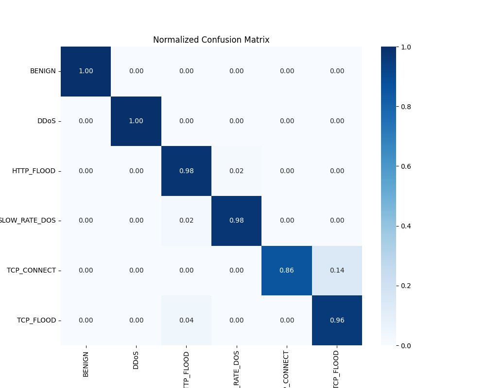
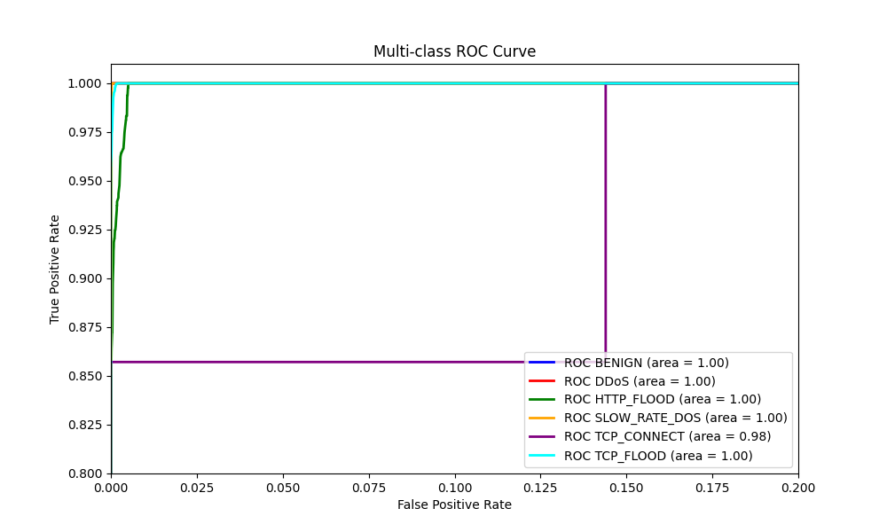

# Hybrid NIDS: Benchmarking XGBoost on Real-World Honeypot Data

## Project Overview

This project is a **systemic comparative study** aimed at identifying the most effective ML algorithm for **Network Anomaly and Intrusion Detection (NIDS)**, specifically focusing on a hybrid data approach.

The study trains and evaluates an **XGBoostClassifier** on a composite dataset containing **CIC-IDS-2017** benchmark traffic and proprietary **T-Pot Honeypot logs** (ITHACA Lab). The primary goal is to achieve high **Precision** and **Recall** across multiple attack classes, ensuring robust detection of both common and rare network threats while minimizing False Positives.

## Dataset Details

* **Benchmark File:** `CIC-IDS- 2017.csv` (Subset: Friday Afternoon DDoS). Used to provide baseline `BENIGN` and `DDoS` traffic patterns.
* **Real-World Files (T-Pot):** `http_flood (1).csv`, `slow_rate_dos.csv`, `tcp_connect.csv`, `tcp_flood.csv`.
* **Preprocessing:** Handled internally by a modular `dataset1.data_preprocess()` function. This includes a novel **Hybrid Labeling Strategy** (Forcing labels on raw logs vs. preserving labels on benchmarks).
* **Splitting Method:** Data is split using `train_test_split` with `test_size=0.20` and `stratify=y` to strictly maintain the class distribution between training and testing sets.
* **Feature Engineering:** Features are dynamically selected based on correlation analysis to reduce dimensionality before training.

## Models

**XGBoostClassifier** (supervised algorithm)
* **Algorithm:** `XGBClassifier` (from `xgboost`).
* **Model Type:** Supervised Learning (Multi-class Classification).
* **Preprocessing Note:** **Rare classes** (classes with fewer than 2 samples) are dynamically identified and removed to prevent cross-validation failures, ensuring statistical stability.
* **Key Parameters:**
    * **Objective:** `'multi:softmax'` (Dynamically adjusts to `'binary:logistic'` if distinct classes < 3).
    * **Learning Rate:** `0.1`
    * **n_estimators:** `200`
    * **Max Depth:** `6`
    * **Regularization:** `reg_alpha=0.1` (L1 regularization to prevent overfitting).
    * **Class Weights:** `sample_weight='balanced'` (Computed via `sklearn`) to heavily penalize misclassification of minority attacks.
* **Evaluation Metrics:**
    * **Accuracy**
    * **Precision** (weighted average)
    * **Recall** (weighted average)
    * **F1-score** (weighted average)
* **Outputs:**
    * **Normalized Confusion Matrix:** Visualizing the discrimination capability between similar attack vectors (e.g., TCP Flood vs. DDoS).
    * **Multi-Class ROC Curves:** Assessing the True Positive Rate vs. False Positive Rate for each individual attack class.

## Training Pipeline
The main workflow executes the following steps sequentially:

1. **Hybrid Data Ingestion & Harmonization:**
   Loads disparate CSV files and unifies their labeling schemas to solve the "conflicting labels" problem.
   ```python
   # Logic implemented in dataset1.py
   if type == "force": label = "HTTP_FLOOD"  # For raw Honeypot data
   if type == "keep":  label = existing_label # For CIC-IDS benchmark

2. **Feature Selection (Correlation Filter):**
   * Calculate the Pearson Correlation Matrix
   * Automatically drops features with a correlation coefficient > **0.95** to mitigate multicollinearity and reduce noise.

3. **Column Management:**
   * Drops zero-variance (single value) columns.
   * Removes non-generalizable data: `['Flow ID','Timestamp','Src IP','Dst IP','Src Port','Dst Port]`.

4. **Target Label Encoding:**
   * The target labels (`HTTP_FLOOD`,`BENIGN`,etc.) are encoded into integers (0,1,2,...) using `LabelEncoder`.
   * A reverse mapping is stored to interpret predictions meaningfully.

5. **Missing Value Imputation:**
   * Handles `NaN` and `Infinity` values (common in flow duration metrics) via `functions.inf_correction` and `functions.fill_missing_values`.

 6. **Features Scaling (Robust):**
    * Unlike standard scaling, this pipeline uses `RobustScaler`.
    * Reasoning: Real-world DDoS attacks produce extreme outliers in packet size and duration.`Robust Scaler` uses the Interquartile Range (IQR), making the model resilient to these anomalies.
    ```python
    scaler = RobustScaler()
    X_scaled_array = scaler.fit_transform(X_numerical)

  ## Code Architecture & Pipeline Analysis
  The project implements a modular architecture to ensuse reproducibillity and scalabillity. This workflow is divided into three core components. **Utility Functions**, **Data Preproccessing Engine** and **Model Training**.

  Below is a detailed breakdown of the logic implemented in each module:

  1. `functions.py` **(Utility Module)**
      This module contains low-level helper functions designed to sanitize raw network traffic data before it enters the main pipeline.
     * `inf_correction(x)`: Network traffic datasets often contain infinite values (e.g `Flow Byte/s`) caused by division by zero. This function detects `±Infinity` values and replaces them with NaN (later handled by imputation), preventing model crashes.
     * `label_encode_column(...)`: Implements categorical variable encoding. Crucially, it returns a `label_map` dictionary, ensuring that the encoded integer labels (0,1,2,...) can be mapped back to their original attack names (e.g `HTTP_FLOOD`) during evaluation.
     * `drop_train_unused(...)`: Removes non-generalizable features such as Source/Destination IPs,Ports and TimeStamps. This prevent the model from overfitting to specific network addresses and forced it to learn traffic behavioral patterns instead.
     * `filling_missing_values(...)`: Handles data imputation for missing entries, ensuring dataset integrity
  
  2. `dataset1.py` **(Preprocessing Enginge)**
      This script acts as the ETL (Extract, Transform, Load) layer, implementing a **Hybrid Data Ingestion Strategy**.
     * **Hybrid Labeling Logic:** The script solves the issue of conflicting labels between disparate datasets using a configuration-based approach:
       * `type="force"`: For the raw T-Pot honeypot logs (which lack specific labels), the script forces the correct attack label based on the file source (e.g `http_flodd.csv` -> `HTTP_FLOOD`).
       * `type=keep`: For the benchmark **CIC-IDS-2017** dataset, it preserves the existing labels (`BENIGN`,`DDoS`), allowing for a seamless fusion of benchmark and real-world data.

     * **Correlation-Based Feature Selection:** To reduce dimensionality and noise, the script calculates the  **Correlation Matrix** and automatically drops features with a Pearson correlation coefficient > **0.95**. This mitigates multicollinearity issues.

     * **Robust Scaling:** Instead of the standard Z-score scaling, `RobustScaler` is applied. This is critical for DDoS datasets, where extreme outliers in `Flow Duration` or `Packet Size` can skew the distribution. `RobustScaler` uses the Interquartile Range (IQR), making the model resilient to these outliers.
    
  3. `XGBClassifier_model.py` **(Model Training & Evaluation)**
     This module handles the machine learning lifecycle using **XGBoost (Extreme Gradient Boosting)**.
     * **Dynamic Objective Selection:**
       * if N = 2, it selects `binary:logistic`
       * if N > 2, it switches to `multi:softmax`, making the system adaptable to different attack scenarios

     * **Class Imbalance Handling:**
       * **Stratified Splitting:** Uses `stratify=y` during the train-test split to ensure tha the ditribution of minority attack classes is preserved in both sets
       * **Sample Weights:** Computes `class_weigths='balanced'` and passes these weigths to the XGBoost cost function. This heavily penalizes the model for the misclassfying rare attacks, preventing bias towards the majority class (`BENIGN`)
      
      * **Stabillity Checks:** Inlcudes a pre-check to identify and remove **rare classes** (classes with < 2 samples) that would otherwise cause cross-validation failuers.
    
## Results
| Model   | Accuracy | Precision | Recall | F1-Score |Notes |
|---------|----------|-------|------|------|------|
| **XGBoostClassifier** | ~99.95    |  ~99.97  | ~99.92 | ~99.96 | Stable training, strong generalization |


### XGBClassifier Confusion Matrix



### XGBClassifier ROC Curve



      
  
   
  
    


   
